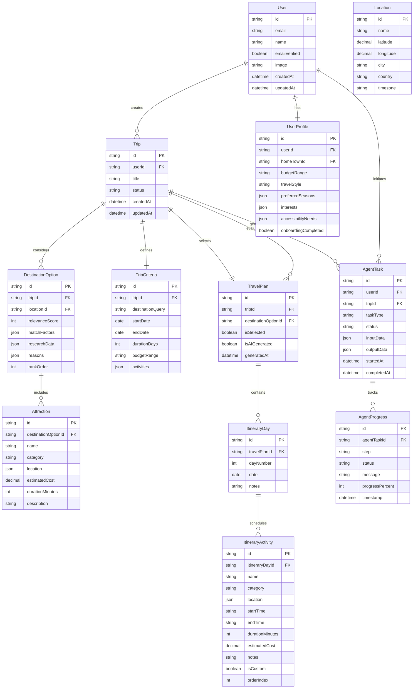

# TripMatch Database Schema Design

## Overview

Based on the flowchart, I'll design a Prisma schema that supports the complete travel planning workflow with real-time AI agent progress tracking. The schema will track user onboarding, trip creation, AI agent tasks, destination research, attraction searches, itinerary generation, and plan evaluations.

## Architecture Diagram



## Core Tables

### 1. **User & Authentication** (Already exists)

Current tables (`User`, `Session`, `Account`, `Verification`) remain unchanged for better-auth integration.

### 2. **UserProfile** - Extended user data

Extends the base User model with travel-specific information collected during onboarding:

- Links to User (one-to-one)
- Links to Location (homeTown)
- Stores preferences: budgetRange, travelStyle, preferredSeasons, interests
- Tracks onboarding completion status

### 3. **Location** - Geographic data

Master table for all locations (hometowns, destinations, attractions):

- Normalized location data with coordinates
- Used by UserProfile (homeTown), DestinationOption, and ItineraryActivity
- Supports map integration

### 4. **Trip** - User's travel planning session

Represents a single trip planning workflow (matches "User Creates Trip" in flowchart):

- Links to User
- Status: `draft`, `planning`, `finalized`, `archived`
- Contains title and timestamps

### 5. **TripCriteria** - Trip input parameters

Stores user's trip requirements (matches "Input Trip Parameters" in flowchart):

- One-to-one with Trip
- Destination query, date range, duration, budget
- Activities and preferences as JSON

## AI Agent Progress Tracking Tables

### 6. **AgentTask** - AI agent execution tracker

**CRITICAL for real-time progress**: Tracks each AI agent operation with status updates:

- Links to User and Trip
- `taskType`: `generate_destinations`, `search_attractions`, `create_itinerary`, `evaluate_plans`
- `status`: `pending`, `in_progress`, `completed`, `failed`
- Stores input parameters and output results as JSON
- Timestamps for start and completion

### 7. **AgentProgress** - Granular step-by-step progress

**CRITICAL for real-time UI updates**: Child records of AgentTask showing incremental progress:

- Links to AgentTask (many-to-one)
- `step`: Description of current operation (e.g., "Researching Paris weather", "Finding attractions")
- `status`: `started`, `completed`, `failed`
- `message`: User-friendly status message
- `progressPercent`: 0-100 for progress bars
- Timestamp for each update
- **WebSocket updates will broadcast new AgentProgress records**

## Destination & Research Tables

### 8. **DestinationOption** - AI-generated or user-specified destinations

Represents possible destinations for the trip (matches flowchart decision "Destination specified?"):

- Links to Trip and Location
- `relevanceScore`: 0-100 ranking from AI
- `matchFactors`: JSON with preference matching details
- `researchData`: JSON storing AI research (weather, reviews, trends, budget analysis)
- `reasons`: Array of strings explaining why this destination fits
- `rankOrder`: For sorting suggestions

### 9. **Attraction** - Points of interest

Activities and places to visit at each destination:

- Links to DestinationOption
- Category: `attraction`, `restaurant`, `accommodation`, `experience`
- Location coordinates, cost, duration
- Generated by Manus AI during "Search Attractions" step

## Itinerary & Planning Tables

### 10. **TravelPlan** - Complete trip itinerary

Represents a full travel plan (matches "Create Travel Plans" in flowchart):

- Links to Trip and DestinationOption
- `isSelected`: User's final choice (matches "Rank and Select Top Plans")
- `isAIGenerated`: Distinguishes AI vs manual plans
- Multiple plans per trip for comparison

### 11. **ItineraryDay** - Daily schedule

Day-by-day breakdown of the trip:

- Links to TravelPlan
- `dayNumber`: Sequential day in trip
- `date`: Actual calendar date
- Notes field for day-level comments

### 12. **ItineraryActivity** - Individual activities

Specific activities within each day (hybrid AI + manual):

- Links to ItineraryDay
- Category, location, timing, cost
- `isCustom`: Tracks if user added/modified (vs AI-generated)
- `orderIndex`: For sorting activities in the day

## Real-Time WebSocket Flow

### Agent Progress Broadcasting

1. **Server Action** initiates agent task → creates `AgentTask` record
2. **Agent execution** creates `AgentProgress` records as it works
3. **WebSocket server** watches for new `AgentProgress` inserts
4. **Client subscribes** to updates for their `AgentTask.id`
5. **UI updates** show progress bar, step messages, and results

### Example Progress Sequence

```typescript
// Agent starts
AgentProgress: { step: "Initializing", status: "started", progressPercent: 0 }

// Agent working
AgentProgress: { step: "Researching destinations", status: "completed", progressPercent: 25 }
AgentProgress: { step: "Analyzing budget options", status: "in_progress", progressPercent: 50 }

// Agent completes
AgentProgress: { step: "Generating recommendations", status: "completed", progressPercent: 100 }
AgentTask: { status: "completed", outputData: {...} }
```

## Key Design Decisions

1. **Prisma over TypeORM**: Keeping existing Prisma setup for consistency
2. **JSON columns**: Used for flexible data (preferences, research results, match factors) that don't need querying
3. **Separate progress table**: Enables granular real-time updates without cluttering main task table
4. **Status enums**: Consistent status tracking across all entities
5. **Soft relationships**: Some JSON-embedded data (location in activities) for flexibility vs strict foreign keys
6. **Normalized locations**: Reusable Location table prevents duplication
7. **Hybrid itineraries**: `isCustom` and `isAIGenerated` flags enable user modifications of AI plans

## Files to Modify

- `[prisma/schema.prisma](prisma/schema.prisma)` - Add all new models
- Create new files:
    - `lib/websocket-server.ts` - WebSocket server for real-time updates
    - `lib/agent-tasks.ts` - Helper functions for agent task management
    - `lib/db.ts` or `lib/prisma.ts` - Prisma client singleton (if not exists)

## Migration Strategy

1. Create Prisma migration for new schema
2. Run migration against Neon PostgreSQL
3. Seed initial data (countries, popular destinations)
4. Set up WebSocket server in Next.js API routes
5. Create server actions for agent task execution
